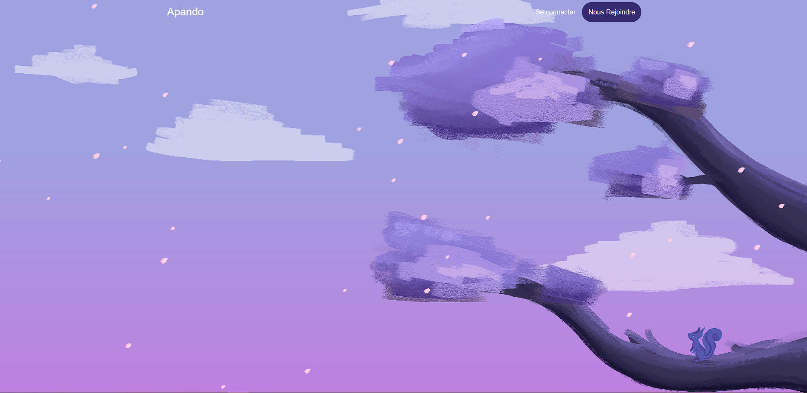
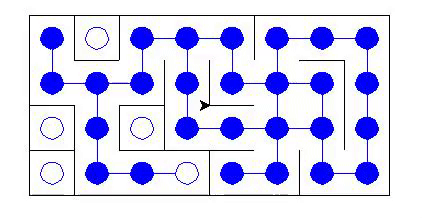
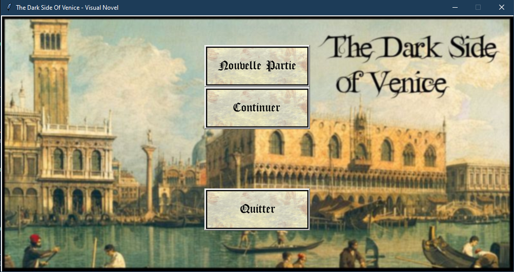
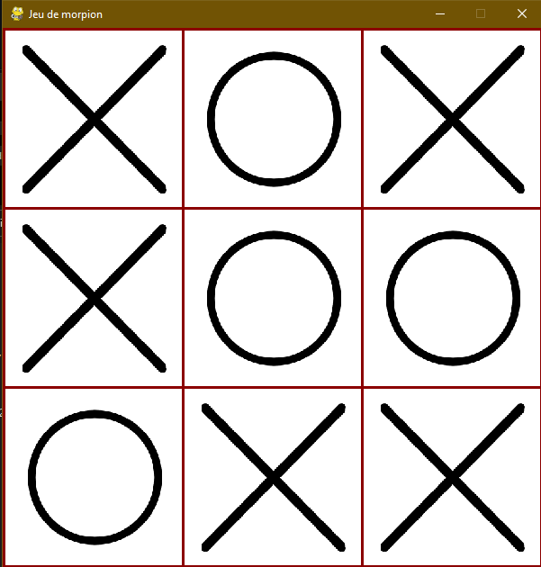

# Hello There, I’m Ilan Mayeux ✨
## Welcome to my Github Page ! 🎉

I'm a french third year college student at @Epita making my way here ! I would be glad to help you in your project or vice-versa !

### 🛠 Ongoing 

Currently working on [Project 86](https://github.com/Taliayaya/Project-86), an open-source fan game on the universe of the 86:Eighty-Six series, featuring an FPS and RTS mix

Working on embedded solutions and sensors for the SEAL laboratory

### 🎯 Goals

Every day is a step forward

- Making even more projects
- Helping you all
- Keep improving my C#, C++, C

### 🎀 Last Project

Last finished project is the 8086 Interpreter, my fourth semester project.

<h2 align="center">📂 Projects</h2>

### [🎮 Project 86 (Ongoing)](https://github.com/Taliayaya/Project-86)

An open-source fan game on the universe of the 86:Eighty-Six series, featuring an FPS and RTS mix.

### [🖥 8086 Interpreter (2024)](https://github.com/Taliayaya/8086-Interpreter)

Simple Intel 8086 ASM interpreter & disassembler for a 16 bit minix2 OS. 

### [🧊 3d Renderer (2023)](https://github.com/Taliayaya/3d-renderer)

A little software to display 3d models and play around with them. Made with OpenGL and Linear Algebra (oh no)

### [🎲 Sudoku OCR (2023)](https://github.com/Taliayaya/S3Project)

A software that takes an image of sudoku as an input and gives back the solution. Image preprocessing, grid and digit detection and recognition with a neural network. Made with GTK

### [🕹 Luminosité Éternelle (2023)](https://github.com/Taliayaya/Luminosite-Eternelle-public)
An adventure multiplayer co-op game where two players try to reach the end of their journey while resolving puzzles, fighting enemies, an traveling a huge mountainous map.

### [💬 Apando (2022)](https://github.com/Taliayaya/Apando)
An open-source chat platform designed for students and schools, currently only in french.

 

### [🧱 Labyrinthe (2022)](https://github.com/Taliayaya/Labyrinthe)
A simple project that simulates and resolves a maze with turtle

 

###  [🎮 The Dark Side of Venice - Visual Novel (2022)](https://github.com/Taliayaya/Visual_Novel)
A visual novel game. The story takes place in Venice, where you try to find out who is the murderer... Currently, this game is only playable in french

  

### [⭕ Tic tac toe (2022)](https://github.com/Taliayaya/nsi-morpion)
A simple tic-tac-toe game playable against an AI or an other player on the same screen.

